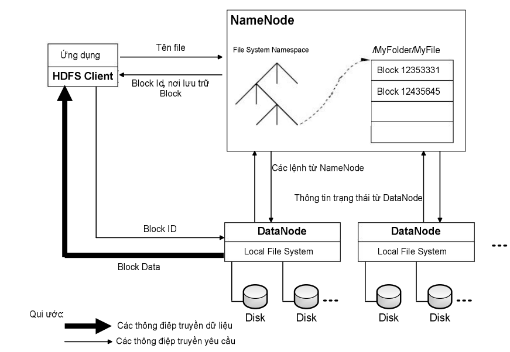

# Sự khác nhau về HDFS và HDFS2
MapReduce 5
hadoop 11

nguyenduyhao1111 viết ngày 17/10/2016

Trước khi so sánh khác nhau về HDFS và HDFS2. Chúng ta đi tìm hiểu về HDFS là cái gì, kiến trúc thế nào?
Vì sao điều này lại quan trọng. Bởi vì đây là điều cơ bản cần biết khi chúng ta muốn hiểu sâu MapReduce trong Hadoop.
Chúng ta cùng đi qua một số câu hỏi về HDFS

## HDFS là gì?

HDFS viết tắt từ Hadoop Distributed File System.

## Lý do nào ra đời HDFS

Khi kích thước của tập dữ liệu vượt quá khả năng lưu trữ của một máy tính, tất yếu sẽ dẫn đến nhu cầu phân chia dữ liệu lên trên nhiều máy tính. Các hệ thống tập tin quản lý việc lưu trữ dữ liệu trên một mạng nhiều máy tính gọi là hệ thống tập tin phân tán. HDFS ra đời trên nhu cầu lưu trữ giữ liệu của Nutch, một dự án Search Engine nguồn mở, và phát triển để đáp ứng các đòi hỏi về lưu trữ và xử lý của các hệ thống xử lý dữ liệu lớn với các đặc thù riêng. Do đó, các nhà phát triển HDFS đã xem xét lại các kiến trúc phân tán trước đây và nhận ra các sự khác biệt trong mục tiêu của HDFS so với các hệ thống file phân tán truyền thống.án.
Đặc điểm của HDFS

* HDFS sẽ chạy trên các cluster có hàng trăm thậm chí hàng ngàn node. Các phần cứng này được xây dựng nên từ các phần cứng thông thường, giá rẻ, tỷ lệ lỗi cao. Do chất lượng phần cứng như vậy sẽ dẫn đến tỷ lệ lỗi cao trên cluster. Vì thế khả năng phát hiện lỗi, chống chịu lỗi, tự phục hồi phải được tích hợp vào trong hệ thống HDFS.
* Kích thước file sẽ lớn hơn nhiều so với chuẩn truyền thống, các file có kích thước hàng GB sẽ trở nên phổ biến. Khi làm việc với dữ liệu có kích cỡ nhiều TB, thì ít khi nào người ta lại chọn việc quản lý hàng tỷ file có kích thước KB. Việc chia dữ liệu thành một ít file có kích cỡ lớn sẽ tối ưu hơn, do việc này giúp giảm thời gian truy xuất dữ liệu và đơn giản hóa việc quản lý tập tin.
* HDFS không phải là một hệ thống file dành cho các mục đích chung. HDFS được thiết kế dành cho các ứng dụng dạng xử lý khối (batch processing). Do đó, các file trên HDFS một khi được tạo ra, ghi dữ liệu và đóng lại thì không thể bị chỉnh sữa được nữa. Điều này làm đơn giản hoá đảm bảo tính nhất quán của dữ liệu và cho phép truy cập dữ liệu với thông lượng cao.

## Kiến trúc HDFS

Giống như các hệ thống file khác, HDFS duy trì một cấu trúc cây phân cấp các file, thư mục mà các file sẽ đóng vai trò là các node lá. Trong HDFS, mỗi file sẽ được chia ra làm một hay nhiều block và mỗi block này sẽ có một block ID để nhận diện.
Các block của cùng một file (trừ block cuối cùng) sẽ có cùng kích thước và kích thước này được gọi là block size của file đó. Mỗi block của file sẽ được lưu trữ thành ra nhiều bản sao (replica) khác nhau vì mục đích an toàn dữ liệu.
HDFS có một kiến trúc master/slave. Trên một cluster chạy HDFS, có hai loại node là Namenode và Datanode. Một cluster có duy nhất một Namenode và có một hay nhiều Datanode.
Namenode đóng vai trò là master, chịu trách nhiệm duy trì thông tin về cấu trúc cây phân cấp các file, thư mục của hệ thống file và các metadata khác của hệ thống file. Cụ thể, các Metadata mà Namenode lưu trữ gồm có:

* File System Namespace: là hình ảnh cây thư mục của hệ thống file tại một thời điểm nào đó. File System Namespace thể hiện tất các các file, thư mục có trên hệ hống file và quan hệ giữa chúng.
* Thông tin để ánh xạ từ tên file ra thành danh sách các block: với mỗi file, ta có một danh sách có thứ tự các block của file đó, mỗi Block đại diện bởi Block ID.
* Nơi lưu trữ các block: các block được đại diện một Block ID. Với mỗi block ta có một danh sách các DataNode lưu trữ các bản sao của block đó.

Các DataNode sẽ chịu trách nhiệm lưu trữ các block thật sự của từng file của hệ thống file phân tán lên hệ thống file cục bộ của nó. Mỗi một block sẽ được lưu trữ như là một file riêng biệt trên hệ thống file cục bộ của DataNode.

## Sơ đồ kiến trúc HDFS

Namenode sẽ chịu trách nhiệm điều phối các thao tác truy cập (đọc/ghi dữ liệu) của client lên hệ thống HDFS. Và tất nhiên, do các DataNode là nơi thật sự lưu trữ các block của các file trên HDFS, nên chúng sẽ là nơi trực tiếp đáp ứng các thao tác truy cập này. Chẳng hạn như khi client của hệ thống muốn đọc một file trên hệ thống HDFS, client này sẽ thực hiện một request (thông qua RPC) đến Namenode để lấy các metadata của file cần đọc. Từ metadata này nó sẽ biết được danh sách các block của file và vị trí của các DataNode chứa các bản sao của từng block. Client sẽ truy cập vào các DataNode để thực hiện các request đọc các block.
Namenode thực hiện nhiệm vụ của nó thông qua một daemon tên namenode chạy trên port 8021. Mỗi DataNode server sẽ chạy một daemon datanode trên port 8022. Định kỳ, mỗi DataNode sẽ báo cáo cho NameNode biết về danh sách tất cả các block mà nó đang lưu trữ, NameNode sẽ dựa vào những thông tin này để cập nhật lại các metadata trong nó. Cứ sau mỗi lần cập nhật lại như vậy, metadata trên NameNode sẽ đạt được tình trạng thống nhất với dữ liệu trên các DataNode. Toàn bộ trạng thái của metadata khi đang ở tình trạng thống nhất này được gọi là một checkpoint. Metadata ở trạng thái checkpoint sẽ được dùng để nhân bản metadata dùng cho mục đích phục hồi lại NameNode nếu NameNode bị lỗi.

## Đọc file trên HDFS

Đầu tiên, client sẽ mở file cần đọc bằng cách gửi yêu cầu đọc file đến NameNode. Sau đó NameNode sẽ thực hiện một số kiểm tra xem file được yêu cầu đọc có tồn tại không, hoặc file cần đọc có đang ở trạng thái “khoẻ mạnh” hay không. Nếu mọi thứ đều ổn, NameNode sẽ gửi danh sách các block (đại diện bởi Block ID) của file cùng với địa chỉ các DataNode chứa các bản sao của block này.
Tiếp theo, client sẽ mở các kết nối tới DataNode, thực hiện một RPC để yêu cầu nhận block cần đọc và đóng kết nối với DataNode. Lưu ý là với mỗi block ta có thể có nhiều DataNode lưu trữ các bản sao của block đó. Client sẽ chỉ đọc bản sao của block từ DataNode “gần” nhất.
Client sẽ thực hiện việc đọc các block lặp đi lăp lại cho đến khi block cuối cùng của file được đọc xong. Quá trình client đọc dữ liệu từ HDFS sẽ transparent với người dùng hoặc chương trình ứng dụng client, người dùng sẽ dùng một tập API của Hadoop để tương tác với HDFS, các API này che giấu đi quá trình liên lạc với NameNode và kết nối các DataNode để nhận dữ liệu.

## Ghi file trên HDFS

Đầu tiên, client sẽ gửi yêu cầu đến NameNode tạo một file entry lên File System Namespace. File mới được tạo sẽ rỗng, tức chưa có một block nào. Sau đó, NameNode sẽ quyết định danh sách các DataNode sẽ chứa các bản sao của file cần gì và gửi lại cho client Client sẽ chia file cần gì ra thành các block, và với mỗi block client sẽ đóng gói thành một packet. Lưu ý là mỗi block sẽ được lưu ra thành nhiều bản sao trên các DataNode khác nhau (tuỳ vào chỉ số độ nhân bản của file).
Client gửi packet cho DataNode thứ nhất, DataNode thứ nhất sau khi nhận được packet sẽ tiến hành lưu lại bản sao thứ nhất của block. Tiếp theo DataNode thứ nhất sẽ gửi packet này cho DataNode thứ hai để lưu ra bản sao thứ hai của block. Tương tự
DataNode thứ hai sẽ gửi packet cho DataNode thứ ba. Cứ như vậy, các DataNode cũng lưu các bản sao của một block sẽ hình thành một ống dẫn dữ liệu data pipe.
Sau khi DataNode cuối cùng nhận thành được packet, nó sẽ gửi lại cho DataNode thứ hai một gói xác nhận rằng đã lưu thành công . Và gói thứ hai lại gửi gói xác nhận tình trạng thành công của hai DataNode về DataNode thứ nhất.
Client sẽ nhận được các báo cáo xác nhận từ DataNode thứ nhất cho tình trạng thành công của tất cả DataNode trên data pipe.
Nếu có bất kỳ một DataNode nào bị lỗi trong quá trình ghi dữ liệu, client sẽ tiến hành xác nhận lại các DataNode đã lưu thành công bản sao của block và thực hiện một hành vi ghi lại block lên trên DataNode bị lỗi.
Sau khi tất cả các block của file đều đã đươc ghi lên các DataNode, client sẽ thực hiên một thông điệp báo cho NameNode nhằm cập nhật lại danh sách các block của file vừa tạo. Thông tin Mapping từ Block ID sang danh sách các DataNode lưu trữ sẽ được NameNode tự động cập nhật bằng các định kỳ các DataNode sẽ gửi báo cáo cho NameNode danh sách các block mà nó quản lý.

Từ HDFS tới HDFS2 ( từ Hadoop 1.0 đến Hadoop 2.0) có gì khác biệt

## Thiết kế gốc của HDFS

Giải quyết bài toán với: 1 Name Node và n DataNodes
## HDFS2

Bài toán đã mở rộng ra với n NameNodes và n DataNodes
Thay đổi lớn nhất là HDFS federation
Lợi ích:

* Tăng không gian data
* Tăng hiệu suất
* Cô lập

Bài tới nói về HDFS federation
