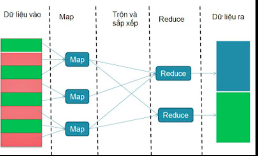

# Tổng quan mô hình lập trình MapReduce
MapReduce 5

nguyenduyhao1111 viết ngày 27/09/2016

## Khái niệm:
Mapreduce là một mô hình lập trình, thực hiện quá tình xử lý tập dữ liệu lớn. Mapreduce gồm 2 pha: map và reduce.
Hàm Map: Các xử lý một cặp (key, value) để sinh ra một cặp (keyI, valueI) - key và value trung gian. Dữ liệu này input vào hàm Reduce.
Hàm Reduce: Tiếp nhận các (keyI, valueI) và trộn các cặp (keyI, valueI) trung gian , lấy ra các valueI có cùng keyI.

Việc của lập trình viên là quan tâm tới 2 hàm Map và Reduce. Còn các vấn đề khác như : phân chia các dữ liệu đầu vào, lịch trình thực thi các machines, handling các machines failure, quản lý việc giao tiếp giữa các machines là việc của hệ thống run-time.
=> Lập trình viên có thể không có kinh nghiệm về hệ thống song song và phân tán vẫn dễ dàng vận hành một hệ thống phân tán lớn.
Áp dụng mô hình MapReduce chạy trên lượng lớn các machine cỡ hàng ngàn machine và data lên đến mức Terabytes.

Các job sau dễ dàng sử dụng Mapreduce:

* Thống kê số từ khóa xuất hiện trong các documents.
* Thống kê số documents có chứa từ khóa.
* Thống kê số câu match với pattern trong các documents.
* Thống kê số URLs xuất hiện trong các web pages.
* Thống kê số lượt truy cập các URLs.
* Thống kê số từ khóa trên các hostnames.
* Distributed Sort.

## Hoạt động:

* Ý tưởng
    * Chia vấn đề cần xử lý thành các phần nhỏ để xử lý.
    * Xử lý các phần nhỏ đó một cách song song và độc lập trên các máy tính phân tán.
    * Tổng hợp các kết quả thu được để dưa ra kết quả cuối cùng.
* Hoạt động của MapReduce có thể được tóm tắt như sau:
    * Đọc dữ liệu đầu vào
    * Xử lý dữ liệu đầu vào (thực hiện hàm map)
    * Sắp xếp và trộn các kết quả thu được từ các máy tính phân tán thích hợp nhất.
    * Tổng hợp các kết quả trung gian thu được ( thực hiện hàm reduce)
    * Đưa ra kết quả cuối cùng.
## Sơ đồ:

* Ví dụ với bài toán wordcount

## Implementation

1. Thông qua thư viện MapReduce ứng dụng với từng ngôn ngữ, chương trình có nhiệm vụ phân mảnh tệp dữ liệu đầu vào. Dữ liệu vào được chia thành các phần nhỏ 16 megabytes đến 64 megabytes (MB). Sau đó khởi động việc sao chép chương trình trên các clusters.
1. Các máy gồm có: master và worker. Trong đó máy master làm nhiệm vụ điều phối sự hoạt động của quá trình thực hiện MapReduce trên các máy worker, các máy worker làm nhiệm vụ thực hiện Map và Reduce với dữ liệu mà nó nhận được. Bằng cách đặt trạng thái idle máy workers và sau đó gắn cho từng máy task map hoặc reduce.
1. Máy master sẽ thực hiện phân phối các tác vụ Map và Reduce vào các worker đang rãnh rỗi. Các tác vụ này được master phân phối cho các máy tính dựa trên vị trí của dữ liệu liên quan trong hệ thống. Máy worker khi nhận được tác vụ Map sẽ đọc dữ liệu mà nó nhận từ phân vùng dữ liệu đã gán cho nó và thực hiện hàm Map. Kết quả đầu ra là các cặp (keyI,valueI) trung gian. Các cặp này được lưu tạm trên bộ nhớ đệm của các máy.
1. Sau khi thực hiện xong công việc Map, các máy worker làm nhiệm vụ chia các giá trị trung gian thành R vùng ( tương ứng với R tác vụ Reduce) lưu xuống đĩa và thông báo kết quả, vị trí lưu cho máy master.
1. Master sẽ gán giá trị trung gian và vị trí của các dữ liệu đó cho các máy thực hiện công việc Reduce. Các máy reducer làm nhiệm vụ xử lý sắp xếp các key, thực hiện hàm Reduce và đưa ra kết quả cuối cùng.
1. Master sẽ kích hoạt thông báo cho chương trình người dùng quá trình MapReduce đã hoàn tất, kết quả đầu ra được lưu trữ trên R tập tin.

Nguồn dẫn từ :
[1] Jeffrey Dean, Sanjay Ghemawat. Mapreduce : Simplified Data Processing on Large Clusters. In OSDI, 2004
